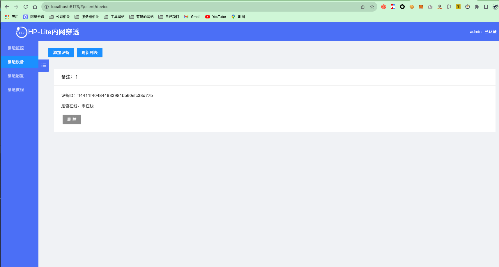
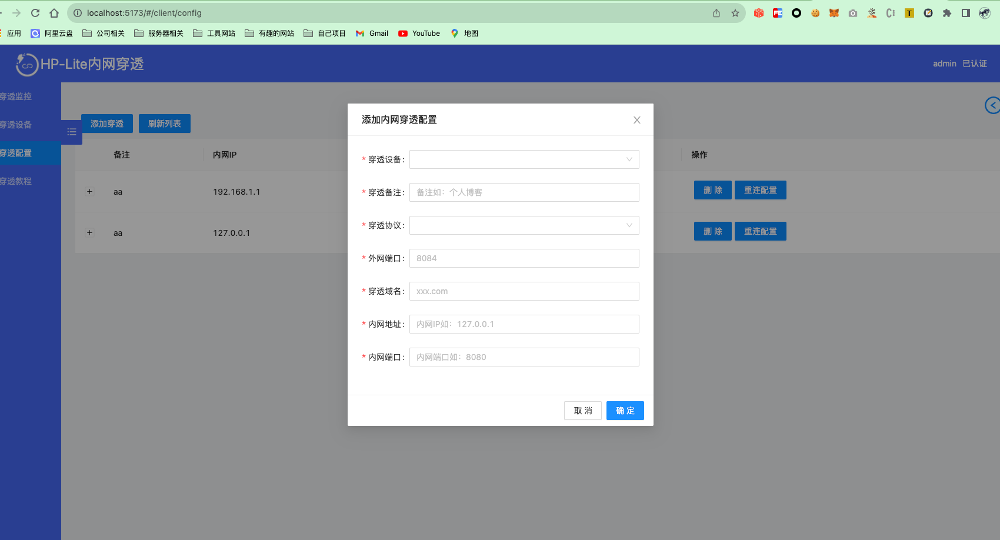
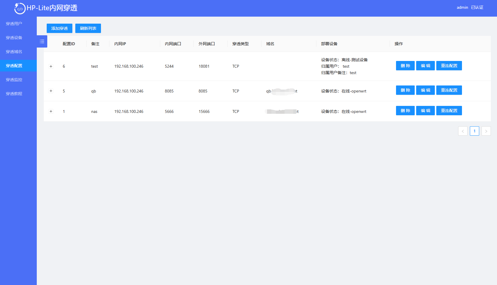
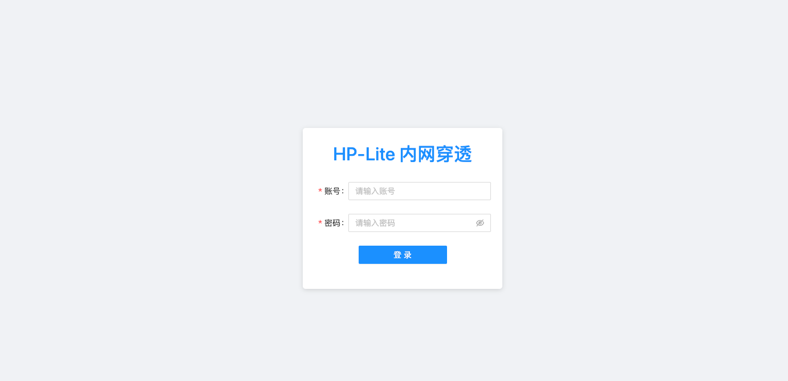
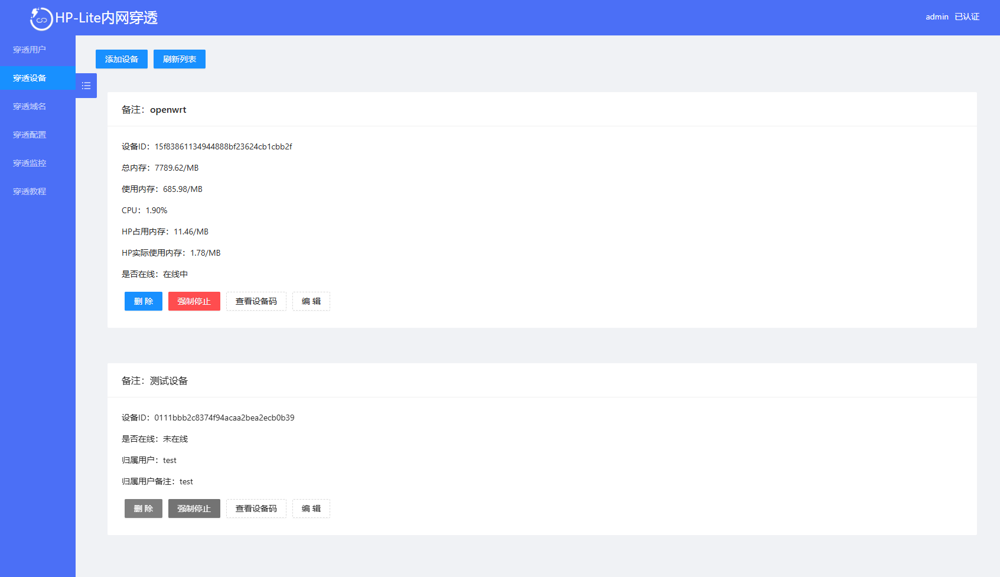
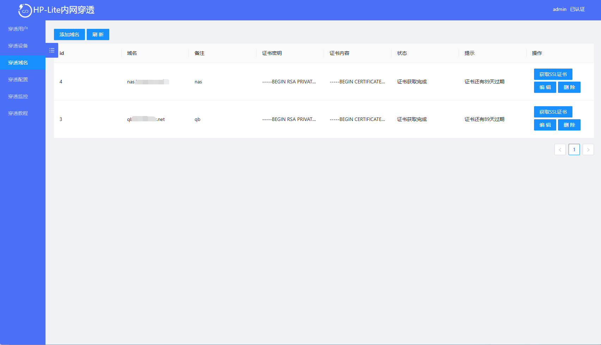

<p align="center">

</p>
<p align="center">
    <a >
        
    </a>
   <a >
        
    </a>
    <a >
        
    </a>

<p align="center">    
    <b>如果对您有帮助，您可以点右上角 "Star" 支持一下 谢谢！</b>
</p>

# HP-Lite 5.0内网穿透

如果你是非常感兴趣，可以通过QQ群进行交流
QQ群：1065301527

#### HP Lite介绍
HP-Lite5.0是一个单机方案
我们采用的是数据转发实现 稳定性可靠性是有保证的即便是极端的环境只要能上网就能实现穿透。
我们是首个支持双通道模式的工具及通道可以选TCP(多路复用)或者QUIC传输，他们都是目前比较高效，高性能的传输方式
我们支持TCP和UDP协议，针对 http/https ws/wss 协议做了大量的优化工作可以更加灵活的控制。让用户使用更佳舒服简单。


### 服务端

#### 二进制文件下载方式
- 下载5.0的二进制文件运行即可
- 配置说明 app.yml
- app.yml文件放在和二进制同目录下即可，不然会默认启动配置
- 建议：部署时关闭所有防火墙，云厂的安全组，注意UDP端口放开，还有TCP，

#### docker 运行方式
- 提前在主机建好 /data/app.yml文件 然后映射过去
```shell
# 通过 阿里云源 docker run 运行容器
sudo docker run --name hp-lite-server --net=host --restart=always -d  -v /data/app.yml:/hp-lite-server/app.yml  -v /data/data:/hp-lite-server/data registry.cn-shenzhen.aliyuncs.com/heixiaoma/hp-lite-server:latest

# 通过Docker官方源运行
sudo docker run --name hp-lite-server --net=host --restart=always -d  -v /data/app.yml:/hp-lite-server/app.yml  -v /data/data:/hp-lite-server/data  heixiaoma/hp-lite-server:latest
```


- app.yml文件
```yaml

admin:
  username: 'admin' #后台账号
  password: '123456' #后台密码
  port: 9090 #管理后台监听的端口（HTTP协议传输方式）

cmd:
  port: 16666 #控制指令端口，所有HP-lite 客户端需要连接这个端口（TCP传输方式）

tunnel:
  ip: '127.0.0.1' #隧道监听服务器外网的IP（记得改成你的服务器IP或者解析的域名也可以）
  port: 9091 #隧道传输数据端口，在5.0以后这个端口支持TCP和QUIC(UDP协议) 所以在开放端口时要给TCP和UDP权限
  open-domain: true #true 开启80，443端口域名转发（如果你的服务有宝塔或者nginx等，端口多半是被用了），false 关闭
acme:
  email: '232323@qq.com' #申请证书必须写一个邮箱可以随便写
  http-port: '5634' #证书验证会访问http接口，会通过80转发过来，所以这个端口不用暴露外网
```

### 服务端安装教程
- 【最好用的内网穿透工具hp-lite搭建教程】 https://www.bilibili.com/video/BV1E6pwzVEAR/?share_source=copy_web&vd_source=9f2661127f08e7489ad9c2f80fbe7740


### 客户端运行方式
##### docker
```shell
# 通过 阿里云源 docker run 运行容器
sudo docker run --name hp-lite --restart=always -d  -e server=xxx.com穿透服务:16666 -e deviceId=32位的设备ID registry.cn-shenzhen.aliyuncs.com/heixiaoma/hp-lite:latest
#直接连接码
sudo docker run --name hp-lite --restart=always -d  -e c=连接码 registry.cn-shenzhen.aliyuncs.com/heixiaoma/hp-lite:latest

# 通过Docker官方源运行
sudo docker run --name hp-lite --restart=always -d -e server=xxx.com穿透服务:16666 -e deviceId=32位的设备ID heixiaoma/hp-lite:latest
#直接连接码
sudo docker run --name hp-lite --restart=always -d -e  c=连接码 heixiaoma/hp-lite:latest
```

##### Linux或者win
```shell
chmod -R 777 ./hp-lite-amd64
#方式1
./hp-lite-amd64 -server=xxx.com穿透服务:16666 -deviceId=32位的设备ID
#方式2
./hp-lite-amd64 -c=连接码
```


## 运行截图







