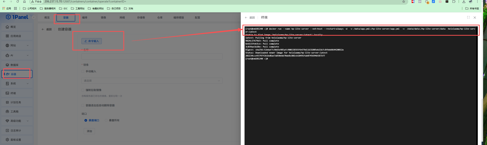

#  1panel部署


### 1. 在1panel文件里创建相关目录


### 2. 找到容器进行创建部署


### 3进行部署


* **以 阿里云源 为例**：

```
docker run --name hp-lite-server --net=host --restart=always -d  -v /data/app.yml:/hp-lite-server/app.yml  -v  /data/data:/hp-lite-server/data registry.cn-shenzhen.aliyuncs.com/heixiaoma/hp-lite-server:latest
```

* **以 docker源 为例**：

```
docker run --name hp-lite-server --net=host --restart=always -d  -v /data/app.yml:/hp-lite-server/app.yml  -v  /data/data:/hp-lite-server/data  heixiaoma/hp-lite-server:latest
```


## 疑难
- 关闭1panel的防火墙，或者放开相关端口
- 关闭云厂商的安全策略组，或者添加相关规则
- 注意1panel安装的nginx和openrest程序是否占用了80和443端口，app.yml的`open-domain`域名转发需要进行关闭