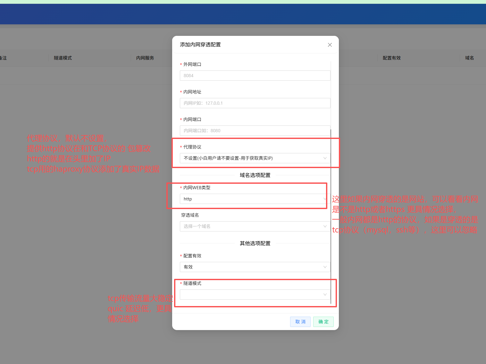

# 使用流程
### 创建设备
> 使用后台的第一步应该是创建设备，在一个网络环境中使用1一个客户端就可以了，一个客户端可以运行多个穿透隧道配置
### 创建域名
> 如果你的穿透的是网站，那么域名尤为重要，当然前提是你部署的服务端接管了80和443，否则没有用
### 创建穿透配置
> 添加穿透配置，相关参数描述 

### 穿透安全配置
> 通过穿透配置，来绑定安全规则，可以现在IP黑白名单，流量大小等