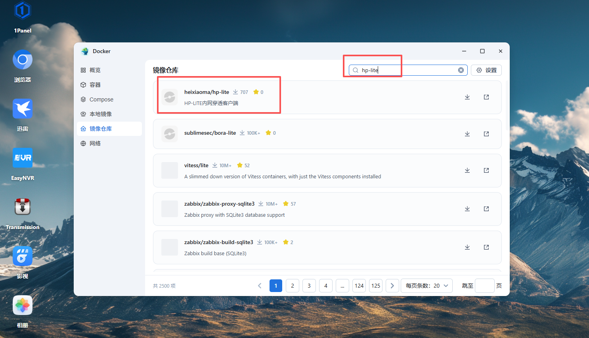
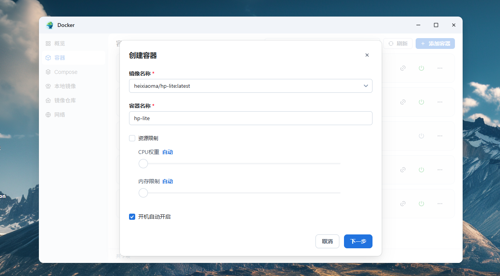
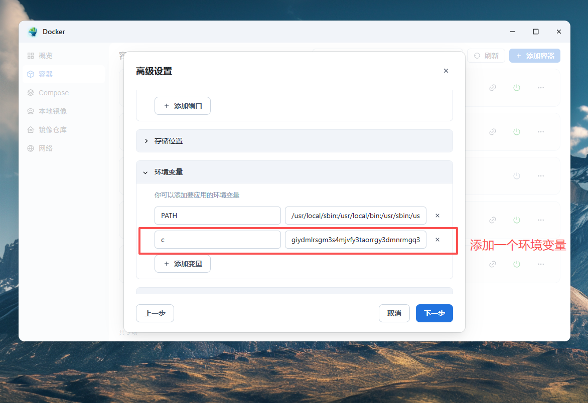
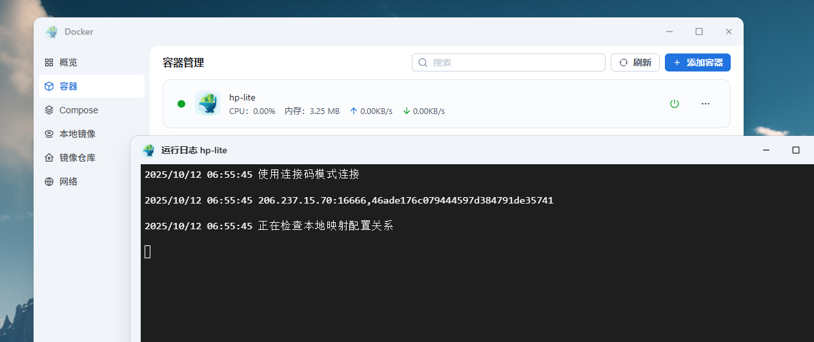

## 飞牛部署
> 这里讲解docker方式使用，其他方式 请参考linux 方式进行部署


### 终端直接执行

* **以 阿里云源 为例**：

```
docker run --name hp-lite --restart=always -d  -e c=连接码 registry.cn-shenzhen.aliyuncs.com/heixiaoma/hp-lite:latest
```
* **以 docker官方源 为例**：


```
docker run --name hp-lite --restart=always -d -e  c=连接码 heixiaoma/hp-lite:latest
```

### 可视化操作
> 拉取镜像



> 创建容器


> 运行完成

