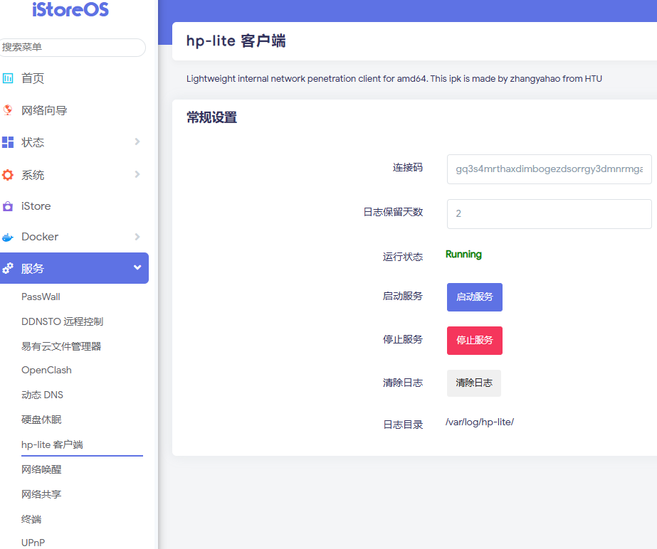
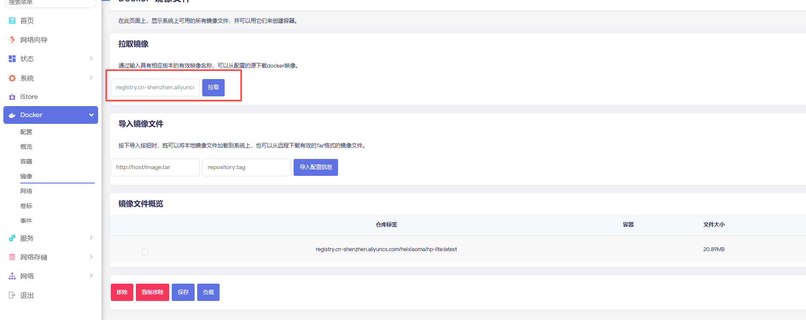
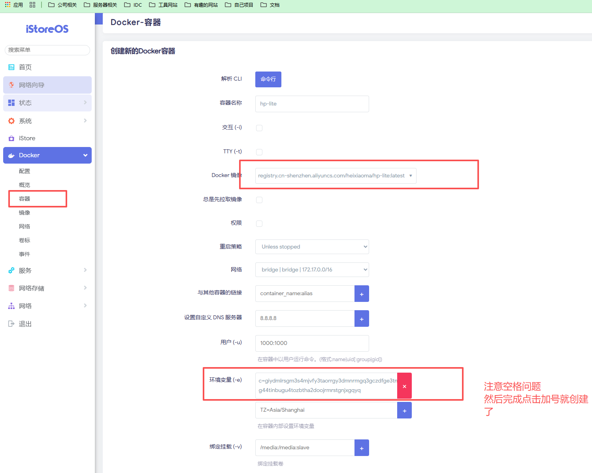
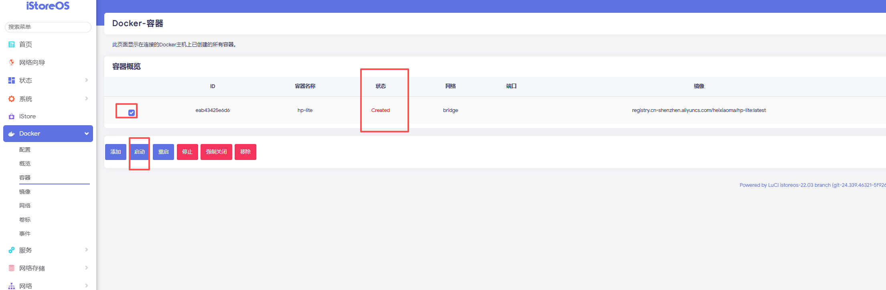

## openwrt部署
> 这里讲解docker方式使用,和IPK安装包方式，如果都不支持 请参考linux 方式进行部署

### IPK文件方式


* 哔站演示地址：https://b23.tv/0Xzc7fP
* IPK文件下载地址：https://pan.baidu.com/s/1QUxPJwMTixFyU6cEeHazGA?pwd=xg1q
> 请确保自己的openwrt架构下载对应的包，目前只支持 arm64和x86架构的IPK文件





### docker方式

#### 方式 1、终端直接执行

* **以 阿里云源 为例**：

```
docker run --name hp-lite --restart=always -d  -e c=连接码 registry.cn-shenzhen.aliyuncs.com/heixiaoma/hp-lite:latest
```
* **以 docker官方源 为例**：


```
docker run --name hp-lite --restart=always -d -e  c=连接码 heixiaoma/hp-lite:latest
```

#### 方式2、可视化操作
> 拉取镜像

> registry.cn-shenzhen.aliyuncs.com/heixiaoma/hp-lite:latest



> 创建容器


> 启动容器

